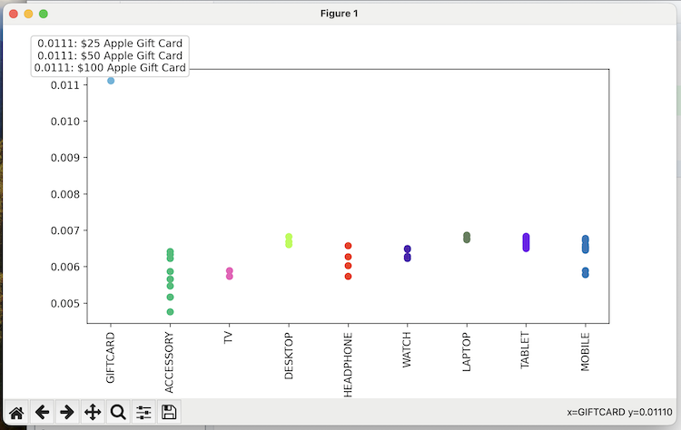
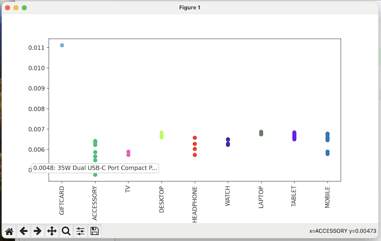

# Maximing Credit Card Redemption Points

### Install dependencies
Run command to install 
```
pip install -r requirements.txt
```
OR
```
pip install pandas numpy matplotlib jupyter
```

### Files
* [analysis.ipynb](analysis.ipynb): Analysis to maximize value of credic card points redeemed
* [visualization.py](visualization.py): Desktop visualization with mouse over to show ¢ per point
```
python3 visualization.py
```
* [files/data.csv](files/data.csv): Data collected and tabulated from redemption website and apple.com as of Nov 18, 2023
    *   Points & prices as on Nov 18th, 2023
    *   The M2 MacBook Pro is no longer available to order, so required some Googling to find historical price
    *   10% discounted gift card, offer valid until Jan 1st, 2024

### Visualization
Maximum value 1.11¢ per point when redeeming Apple Gift Cards


Minimum value 0.48¢ per point when redeeming 35W Dual USB-C Port Compact Power Adapter

